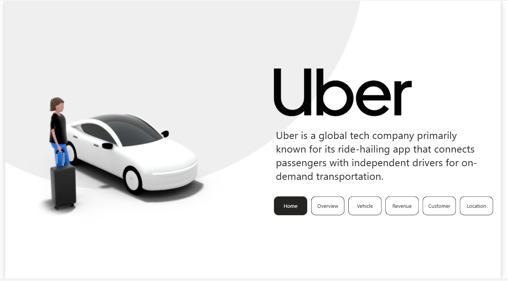
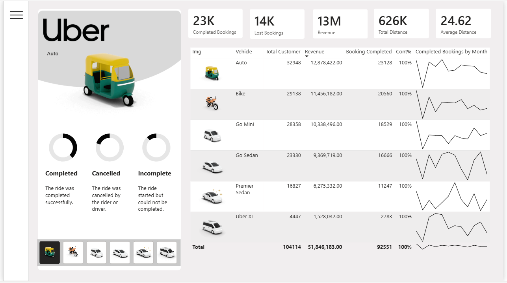
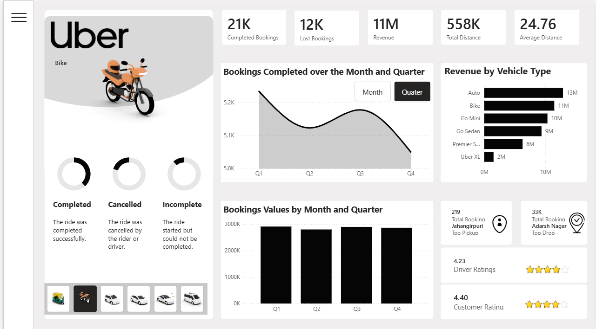
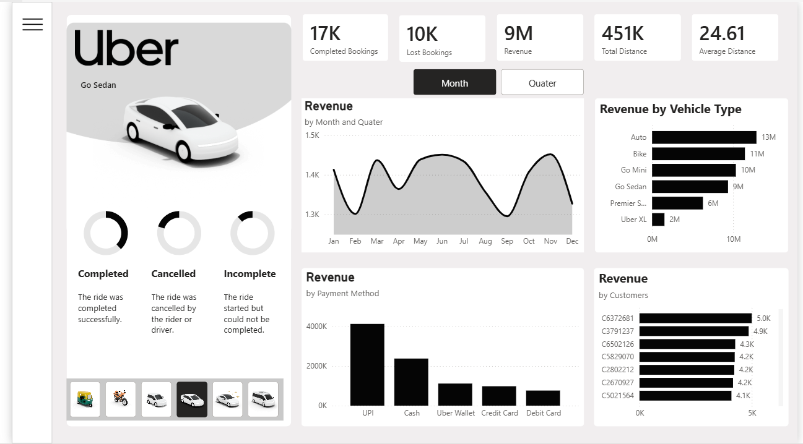
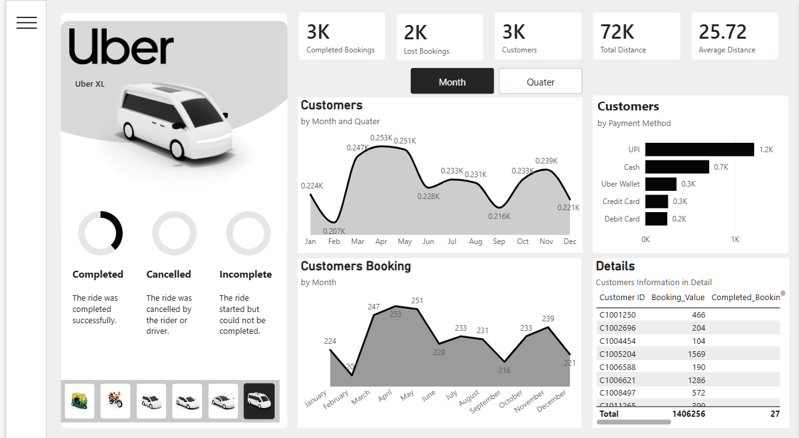
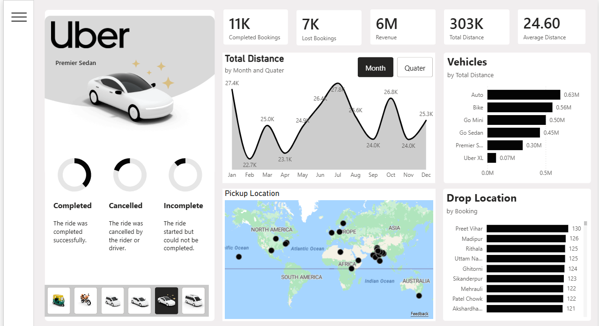

# 🚕 Uber Ride Analytics — Power BI Dashboard

An end-to-end Power BI dashboard analyzing ride-hailing operations for an Uber-style platform — covering bookings, revenue, vehicle performance, customer behavior, and pickup/drop locations across a 100K+ booking dataset.



---

## 📌 Project Overview

This project transforms raw ride-booking data into a multi-page, interactive Power BI report designed for three audiences: **operations managers** (fleet & revenue performance), **customer support agents** (customer-level behavior and cancellations), and **business stakeholders** (high-level KPIs at a glance).

The report is built around a single global filter — **vehicle type** (Auto, Bike, Go Mini, Go Sedan, Premier Sedan, Uber XL) — selectable from an image-based navigator on every page, so every metric can be sliced by vehicle without leaving the current view.

**Dataset scale:** ~104K completed bookings · ₹51.8M+ total revenue · 14K+ customers · 700K+ km total distance tracked.

---

## 🗂️ Pages

The report has 6 pages, navigable from the Home screen:

| Page | Purpose |
|---|---|
| **Home** | Landing page with project description and navigation |
| **Overview** | Cross-vehicle summary table — the single source of truth for totals |
| **Vehicle** | Performance breakdown for the selected vehicle type (bookings, revenue trend, ratings) |
| **Revenue** | Revenue trends by month/quarter, by vehicle, by payment method, by top customers |
| **Customer** | Customer volume trends, payment method mix, and a searchable customer detail table |
| **Location** | Geographic view — pickup location map and top drop-off zones |

---

### 🏠 Home

Landing page introducing the project and providing button-based navigation to every other page.


---

### 📊 Overview

A single roll-up table across all six vehicle types — Total Customers, Revenue, Completed Bookings, completion %, and a per-vehicle monthly trend sparkline — with a grand total row. This is the page to check when validating numbers on any other page.



**Key totals (all vehicles combined):**
- Total Customers: **104,114**
- Total Revenue: **₹51,846,183**
- Completed Bookings: **92,551**
- Completion Rate: **100%** *(of attempted bookings for that vehicle type)*

---

### 🚗 Vehicle

Deep-dive into a single vehicle type: booking volume by month/quarter, revenue by vehicle type (for comparison), booking value trend, top pickup/drop zones, and both driver and customer average ratings.



---

### 💰 Revenue

Revenue-focused view: monthly/quarterly revenue trend, revenue split by vehicle type, revenue by payment method (UPI leads, followed by Cash), and the top revenue-generating customers.



---

### 👥 Customer

Customer-centric view: customer volume trend by month/quarter, payment method preference, and a detail table listing individual customers with booking value and completed bookings — built for drilling into a specific customer's history.



---

### 📍 Location

Geographic analysis: total distance traveled by month/quarter, distance by vehicle type, a world map of pickup locations, and a ranked list of top drop-off zones (e.g., Preet Vihar, Madipur, Rithala).



---

## 🧮 Data Model

The model follows a star-schema pattern with one central fact table and supporting dimension/measure tables:

```
Calender (date dim) ──┐
                       ├──► Uber (fact table)
Veh_IMG (vehicle dim) ─┘         │
                                  ▼
                          MeasuresDax (measures)
                          Cancel Rides (field parameter)
                          Date_Axis (field parameter)
```

| Table | Type | Key Fields |
|---|---|---|
| `Uber` | Fact | Booking ID, Booking Status, Booking Value, Customer ID, Customer Rating, Date, Driver Cancellation Reason |
| `Calender` | Dimension | Date, Month, MonthIndex, Quarter, QuarterIndex |
| `Veh_IMG` | Dimension | Vehicle Type, Img (drives the vehicle icon selector) |
| `MeasuresDax` | Measures table | Booking_Count, Booking_Value, Completed_Bookings, Lost_Bookings, Average_Distance, Total_Distance, Customer_Count, Cont% |
| `Cancel Rides` | Field parameter | Powers the Driver / Customer / Incomplete cancellation slicer |
| `Date_Axis` | Field parameter | Powers the Month / Quarter toggle on trend charts |

### Sample DAX measures

```dax
Lost_Bookings =
CALCULATE (
    [Booking_Count],
    Uber[Booking Status] IN { "Cancelled", "Incomplete" }
)

Cont% =
DIVIDE ( [Completed_Bookings], [Booking_Count], 0 )

Average_Distance =
AVERAGE ( Uber[Total Distance] )
```

---

## 🛠️ Tech Stack

- **Power BI Desktop** — report authoring
- **DAX** — measures and calculated logic
- **Power Query (M)** — data shaping and transformation
- **Field Parameters** — dynamic Month/Quarter and cancellation-reason toggles
- Native visuals only (Cards (New), Line/Area charts, Bar charts, Table, Map, Donut/Gauge) — no custom AppSource visuals required

---

## 📁 Suggested Repository Structure

```
uber-ride-analytics-powerbi/
├── README.md
├── assets/
│   ├── 01_home.png
│   ├── 02_revenue.png
│   ├── 03_overview.png
│   ├── 04_vehicle.png
│   ├── 05_customer.png
│   └── 06_location.png
├── data/
│   └── uber_bookings.csv         # raw/sample dataset (add your source data)
├── Uber_Analytics.pbix            # main Power BI report file
└── docs/
    └── data-dictionary.md         # optional: full field descriptions
```

---

## 🚀 Getting Started

1. **Clone the repo:**
   ```bash
   git clone https://github.com/<your-username>/uber-ride-analytics-powerbi.git
   ```
2. **Open `Uber_Analytics.pbix`** in [Power BI Desktop](https://powerbi.microsoft.com/desktop/) (free).
3. If prompted, point the data source to your local copy of the dataset in `/data`.
4. Refresh the data (**Home → Refresh**) and explore the report using the vehicle-type navigator on the left of every page.

> **Requirements:** Power BI Desktop (latest version recommended). No paid license needed to open and explore the `.pbix` file locally.

---

## 🔍 Key Insights

- **UPI is the dominant payment method** by a wide margin, followed by Cash — card-based payments (Credit/Debit) are the smallest share.
- **Auto and Bike generate the highest revenue** despite lower per-trip value than Sedan/XL categories, driven by significantly higher booking volume.
- **Cancellations run in the ~35-40% range of total bookings** across vehicle types (Lost Bookings vs. Completed Bookings), making cancellation-reason analysis a high-value area for the Customer page.
- **Revenue and customer volume both show a mid-year dip** (Feb/Mar and Aug), consistent across vehicle types — worth investigating against seasonality or external events.

---

## 🧭 Roadmap / Possible Enhancements

- [ ] Add a dedicated Cancel Rides KPI with drillthrough to a cancellation-detail page
- [ ] Peak usage hours heatmap (requires timestamp-level source data, not currently in the model)
- [ ] Refund / dispute tracking (requires a new fact table from source system)
- [ ] Customer segmentation (RFM-style) for support prioritization
- [ ] Row-level security if this report is shared across regional teams

---

## 📄 License

This project is provided as-is for portfolio/demonstration purposes. Add a license (e.g., MIT) here if you intend to open-source the underlying `.pbix` and data.

---

## 🙋 About

Built as a Power BI portfolio project demonstrating end-to-end dashboard design — data modeling, DAX, field parameters, and multi-page UX — for a ride-hailing business use case.
